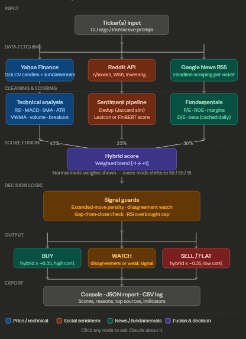

# Hybrid Technical + Social Sentiment Signal Scanner

A sophisticated stock analysis tool that combines technical indicators, social sentiment from Reddit, and news sentiment to generate trading signals.

## Architecture



## Features

- **Technical Analysis**: RSI, MACD, EMA, ATR, VWMA, and custom breakout detection
- **Sentiment Analysis**: Lexicon-based scoring with optional FinBERT transformer support ✅
- **Social Media Integration**: Reddit mentions from r/stocks, r/investing, r/wallstreetbets, etc.
- **News Integration**: Google News RSS feed analysis
- **Fundamental Analysis**: Key financial metrics (P/E, ROE, debt-to-equity, etc.)
- **Hybrid Decision Making**: Combines all signals with configurable weights
- **Multiple Output Formats**: Console table, JSON reports, CSV logging

## Project Structure

```
sentiment-analysis/
├── main.py                 # CLI entry point
├── src/
│   ├── __init__.py        # Package initialization
│   ├── data.py            # Data structures and data fetching
│   ├── indicators.py      # Technical analysis functions
│   ├── sentiment.py       # Sentiment analysis and social media
│   ├── utils.py           # Utility functions and output formatting
│   └── scanner.py         # Main scanning logic
├── cache/
│   └── fundamentals.json  # Cached fundamental data
├── architecture.png       # System architecture diagram
├── hybrid_signal_scanner_pipeline.svg  # Pipeline visualization
└── README.md             # This file
```

## Installation

1. Install Python dependencies from the parent project:
```bash
pip install -r ../requirements.txt
# Optional: for FinBERT sentiment analysis
pip install transformers torch
```

2. Run the scanner:
```bash
python main.py --tickers AAPL,MSFT,GOOGL
```

## Usage

### Basic Usage
```bash
# Scan multiple tickers
python main.py --tickers AAPL,TSLA,NVDA

# Interactive mode
python main.py --interactive

# Use FinBERT for sentiment (if installed)
python main.py --tickers AMD --use-finbert
```

### Advanced Options
```bash
# Different timeframes
python main.py --tickers SPY --interval 1h --range 1mo

# Save results
python main.py --tickers AAPL --json-out results.json --csv-log signals.csv

# Show detailed sources
python main.py --tickers TSLA --show-sources --source-limit 5

# Debug Reddit fetching
python main.py --tickers AMD --reddit-debug
```

## Configuration

The scanner uses a unified decision policy with configurable weights:

- **Event Mode**: Triggered when technical score ≥ 0.70
  - Sentiment: 50%, Technical: 35%, Fundamental: 15%
- **Normal Mode**:
  - Sentiment: 25%, Technical: 45%, Fundamental: 30%

**Sentiment Analysis Options:**
- **Lexicon-based** (default): Fast, lightweight word-list approach
- **FinBERT** (`--use-finbert`): Advanced transformer model trained on financial text, provides more nuanced sentiment analysis but requires additional dependencies and is slower

## Data Sources

- **Price Data**: Yahoo Finance API
- **Reddit**: r/stocks, r/investing, r/wallstreetbets, r/options, r/stockmarket
- **News**: Google News RSS feeds
- **Fundamentals**: Yahoo Finance quote summary

## Output Formats

### Console Table
```
Ticker | Action | Conf | Mode     | Hybrid | Tech | Sent | Mentions | Close  | RSI  | VolX
AAPL   | BUY    | HIGH | unified  | +0.75  | +0.8 | +0.6 | 12       | 185.42 | 68.5 | 1.23
```

### JSON Report
```json
{
  "generated_at": "2024-01-15T10:30:00+00:00",
  "meta": {
    "mode": "live",
    "finbert": false,
    "interval": "1d",
    "tickers_scanned": 1
  },
  "results": [...]
}
```

## Decision Logic

The hybrid scoring system combines multiple factors:

1. **Technical Score** (-1.0 to +1.0): RSI, MACD, breakouts, volume, trends
2. **Sentiment Score** (-1.0 to +1.0): Reddit + news sentiment with recency weighting
3. **Fundamental Score** (-1.0 to +1.0): Profit margins, ROE, leverage ratios
4. **Mention Bonus**: Additional boost for high social media activity

Final action determination:
- **BUY**: Hybrid score ≥ 0.60 (HIGH confidence), ≥ 0.30 (MEDIUM)
- **SELL**: Hybrid score ≤ -0.60 (HIGH), ≤ -0.30 (MEDIUM)
- **WATCH**: Disagreement between technical/sentiment signals
- **HOLD**: Low confidence signals

## Dependencies

- requests: HTTP client for APIs
- transformers (optional): FinBERT sentiment model
- torch (optional): PyTorch for FinBERT
- yfinance (fallback): Alternative fundamental data source

## License

This project is for educational and research purposes only. Not financial advice.