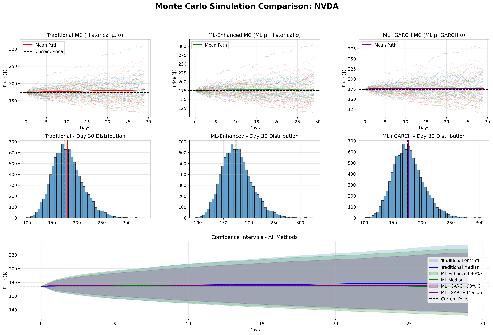

# ML Volatility Forecasting

This repository contains a modular implementation of an ML + GARCH-enhanced Monte Carlo simulator for stock price forecasting.

## Structure

- `src/data.py`: Data fetching from Polygon API (`fetch_polygon_data`).
- `src/features.py`: Feature engineering and plotting utilities.
- `src/model.py`: Model training (RF + GB + Ridge VotingRegressor).
- `src/garch.py`: GARCH fitting and volatility forecasting.
- `src/simulation.py`: Monte Carlo simulators (traditional, ML-enhanced, ML+GARCH).
- `main.py`: Runner script for end-to-end pipeline.

## Setup

1. Create and activate a Python environment (recommended):

   ```bash
   python -m venv .venv
   source .venv/bin/activate  # Linux/macOS
   .venv\Scripts\activate  # Windows
   ```

2. Install dependencies:

   ```bash
   pip install -r requirements.txt
   ```

3. Set environment variables:

   ```bash
   export POLYGON_API_KEY="your_key"    # macOS/Linux
   setx POLYGON_API_KEY "your_key"      # Windows
   ```

   Optional overrides:

   - `TICKER` (default `NVDA`)
   - `DAYS_TO_FETCH` (default `730`)
   - `DAYS_TO_SIMULATE` (default `30`)
   - `NUM_SIMULATIONS` (default `10000`)
   - `RANDOM_SEED` (default `42`)

## Run

```bash
python main.py
```

## Output

The system generates:
- **Console output**: Comprehensive analysis with model performance, risk metrics comparison, and statistical summaries
- **Visualization**: Monte Carlo simulation comparison plot saved to `output/` directory
- **Risk metrics**: VaR, expected returns, volatility estimates, and probability of profit for all three simulation methods

## Features

- **Data Fetching**: Polygon.io API integration for high-quality financial data
- **Feature Engineering**: Technical indicators (MA, momentum, Bollinger Bands, volatility ratios)
- **ML Modeling**: Ensemble of Random Forest, Gradient Boosting, and Ridge regression
- **GARCH Volatility**: Advanced volatility forecasting using GARCH(1,1) model
- **Monte Carlo Simulation**: Three simulation methods (Traditional, ML-enhanced, ML+GARCH)
- **Risk Analysis**: Comprehensive risk metrics including VaR and profit probabilities

Optional environment variables:
- `OUTPUT_DIR` (default `output`)
- `TICKER` (default `AAPL`)
- `DAYS_TO_FETCH` (default `730`)
- `DAYS_TO_SIMULATE` (default `30`)
- `NUM_SIMULATIONS` (default `10000`)
- `RANDOM_SEED` (default `42`)

The script will:
- Fetch data from Polygon API
- Train ML models and run Monte Carlo simulations
- Generate comparison plots and risk metrics
- **Save plots as PNG files** under `output/` (or `OUTPUT_DIR` override)
- Display plots interactively if possible, with a prompt to close

## Machine Learning in this project

This repository combines classical volatility estimation with machine learning (ML) and GARCH time-series modeling to make more informed Monte Carlo forecasts.

- `src/features.py`: constructs lagged returns, realized volatility, moving averages, and other predictors that feed ML models.
- `src/model.py`: trains and evaluates:
  - Random Forest (`RandomForestRegressor`): captures nonlinear relationships between features and future log-returns/volatility.
  - Gradient Boosting (e.g., `HistGradientBoostingRegressor` or `XGBRegressor`): learns residual structure and improves accuracy in forecasting volatility spikes.
  - Ridge / Voting Regressor ensemble: stabilizes prediction and reduces overfitting by combining linear and tree-based models.

### How ML is used for volatility forecasting

1. Historical price data is fetched from Polygon and converted into log-returns.
2. Features are engineered (`src/features.py`) for a supervised learning target (next-day return / volatility).
3. Models are trained in `src/model.py` and persisted; predictions are used to set the drift (`mu`) parameter in the ML-enhanced simulations.
4. Simulation code in `src/simulation.py` uses:
   - Traditional Monte Carlo (historical `mu`, `sigma`)
   - ML-enhanced Monte Carlo (ML `mu`, historical `sigma`)
   - ML+GARCH Monte Carlo (ML `mu`, GARCH `sigma`)
5. Output distributions then compare forecast scenarios and risk metrics.

## Visual results (example)



> Tip: Run `python main.py` to generate `.png` output automatically, then update the image path if your file is saved elsewhere.

## Results

### NVDA Volatility Forecasting (as of March 27, 2026)

Current Price: $171.24  
ML Predicted Next-Day Log-Return: 0.001856 (≈ 0.1856%)

Historical Statistics:  
- Mean Daily Log-Return: 0.168%  
- Daily Volatility (Std of Log Returns): 3.094%

GARCH Model Parameters:  
- Omega (constant): 0.221  
- Alpha (ARCH term): 0.092  
- Beta (GARCH term): 0.889  
- Forecasted First-Day Volatility: 2.26%

**Save plots as PNG files**
`monte_carlo_NVDA_20260327_111937.png`